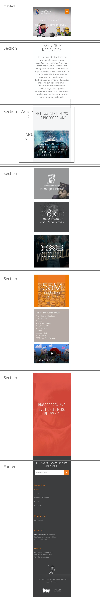
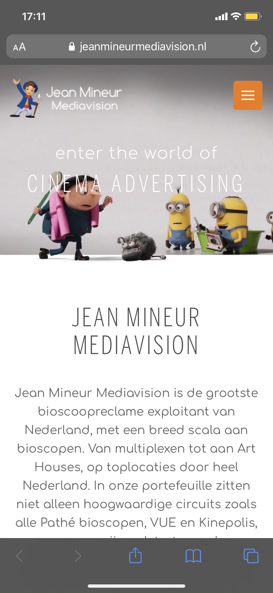
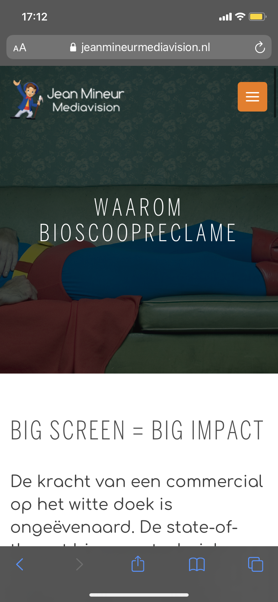

# Procesverslag
**Auteur:** -Ashley Muts-

Markdown cheat cheet: [Hulp bij het schrijven van Markdown](https://github.com/adam-p/markdown-here/wiki/Markdown-Cheatsheet). Nb. de standaardstructuur en de spartaanse opmaak zijn helemaal prima. Het gaat om de inhoud van je procesverslag. Besteedt de tijd voor pracht en praal aan je website.

## Bronnenlijst

https://www.w3schools.com/css/css_form.asp

https://www.w3schools.com/html/html_entities.asp

https://www.w3schools.com/cssref/sel_after.asp

https://www.htmlsymbols.xyz/unicode/U+2794

https://stackoverflow.com/questions/24365580/before-after-not-working-on-the-input-type-submit

https://www.w3schools.com/cssref/css_entities.asp

https://www.w3schools.com/html/html_iframe.asp

https://www.maps.ie/create-google-map/

https://graphemica.com/%E2%98%B0

https://stackoverflow.com/questions/23750346/how-to-resize-unicode-characters-via-css

https://graphemica.com/%E2%9D%8C

En nog veel meer.....

## Eindgesprek (week 7/8)

Wat ik eigenlijk al een beetje in week 6 heb verteld. Ik vond het lastig om classes weg te werken omdat ik in de eerste week zo mijn html had opgebouwd. Het omschakelen heeft mij een paar dagen gekost. Dit omdat ik vaak in de war raakte of dat bepaalde elementen opnieuw gestyled moesten worden.

In het eerste jaar vond ik het lastiger om informatie op te zoeken. Bij dit project merkte ik dat het wat makkelijker ging en snel kon opzoeken wat ik nodig had. Dit ook omdat ik de code wat meer begrijp. 

**Screenshot(s):**

-screenshot(s) van je eindresultaat-

## Verslag Screenreader (week 7)

Na aanleiding van de opdracht om met een screenreader je code door te gaan heb ik de screenreader van mijn macbook aangezet. De screenreader werkt echter alleen op safari en niet op andere browsers. De screenreader gaat makkelijk door de pagina heen en leest alles op. Mijn macbook staat in het Nederlands dus krijg ik ook een Nederlandse screenreader. Hierdoor kan mijn screenreader Engelse (andere taal) woordjes niet op de juiste manier oplezen.

## Voortgang 3 (week 6)

Ik ben niet veel verder met mijn website gekomen. Dit kwam door meerdere deadlines voor andere vakken dit blok. Ik vind het lastig dat we nu een nieuwe manier leren om html en css op te bouwen. Het heeft mij een half jaar gekost om uberhaupt html en css goed te leren. Dit omdat ik nog nooit eerder had gecodeerd. In de vakantie heb ik een planning gemaakt om verder aan mijn website te gaan.

## Voortgang 2 (week 5)

Toen ik na het voortgang 1 weer verder ging coderen opende ik de website en had ik veel whitespace aan de zijkant. Ik heb alles afgesloten en opnieuw opgestart maar het bleef hetzelfde ik heb alles opnieuw aangepast zodat het goed stond.

## Voortgang 1 (week 3)

### Stand van zaken

Ik vond het een beetje lastig om van start te gaan met frontend. Na een weekje ging het veel makkelijker en ging ik goed op weg.

**Screenshot(s):**

### Agenda voor meeting

-samen met je groepje opstellen-

| Ashley Muts    | Dionysha           | student 3    | student 4        |
| ---            | ---                | ---          | ---              |
| background 
  donkerder      | vraag over footer  |              |                  |
|                |                    |              |                  |
| ...            | ...                | ...          | ...              |

### Verslag van meeting

Ik heb filter: brightness gebrobeerd. Hierdoor werd de hele afbeelding donkerder waaronder de tekst.

## Breakdownschets (week 1)

## Intake (week 1)
-uitwerken voor de kick-off werkgroep - begin van de eerste week-

**Je startniveau:** -rood-

**Je focus:** -surface plane-

**Je opdracht:** -https://www.jeanmineurmediavision.nl/-

**Screenshot(s) van de eerste pagina (small screen):**

**Screenshot(s) van de tweede pagina (small screen):**

